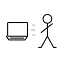
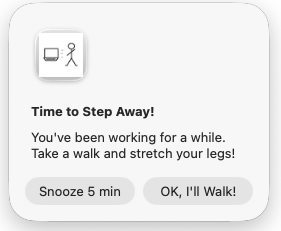
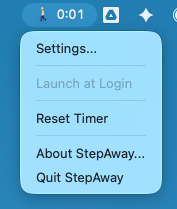

<table><tr>
<td></td>
<td valign="top"><h1>StepAway</h1></td>
</tr></table>

A macOS menu bar app that reminds you to take walking breaks. It was entirely written by Claude. I find that when using an AI it is too easy to forget to do this. I welcome contributions (like a better icon).



## What it does

- Shows a countdown timer in your menu bar: 🚶 45:00
- Alerts you when it's time to step away
- Pauses automatically when you're away from your computer
- Resumes when you return



## Install

Build from source:

```bash
git clone https://github.com/the-michael-toy/StepAway.git
cd StepAway
xcodebuild -project StepAway.xcodeproj -scheme StepAway -configuration Release build
cp -R ~/Library/Developer/Xcode/DerivedData/StepAway-*/Build/Products/Release/StepAway.app /Applications/
```

## Requirements

macOS 12.0 or later

## License

[CC0 1.0](LICENSE.md) - Public domain. Do whatever you want with it.

---

A product of the [Apocalyptic Art Collective](https://apocalypticartcollective.com/)
